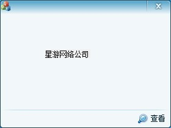

# MFC无标题栏自绘对话框可拖动按钮三态仿QQ弹窗样式
_2013-08-13 13:07:24_

* * *

    代码提供下载，想边看程序源码边看文章的朋友直接去下载：[下载](./download/DialogEx.rar)

    看我前几天的bolg我实现了右下角弹窗功能，但是怎么美化自己的弹窗呢，像腾讯QQ右下角弹腾讯大豫网新闻那样的样式。

    首先感谢一篇重要的文章：http://bbs.csdn.net/topics/390170722  作者：邓学彬

    但是也需要指出大凡已经很牛的人，对初学者的求助往往是漠不关心的，我对他文章的回复他至今还没有回答我的问题，我给的留言也没有收到回音，为什么要感谢他，因为它用Win32(SDK)开发出来的程序，虽然我不想直接拿来用，但是它让我坚信，假以时日我用MFC也可以实现的...

    直接上图：



    单文档的美化我尝试过，用的是重绘非客户区的方法，遇到各种各样的问题，一言难尽，现在我把这段时间美化对话框应用程序的经验整理出来希望对初学者有点用。首先美化界面不靠其他界面库的话，就要自己贴图了，提到贴图就要提一下在哪个函数里贴图比较好，孙鑫VC++教程第10课的样子，提到在OnPaint() 和 OnEraseBkgnd()两个函数中绘制的区别，区别就是OnEraseBkgnd是直接住上贴图，OnPaint贴图之前则是先调用OnEraseBkgnd擦除背景，这样以来在OnEraseBkgnd中贴图就会相对好些。一些没有看过教程的朋友初次绘图发现一切正常，怎么就是不出绘图效果呢，看一下MSDN对OnEraseBkgnd的介绍，“返回非零表示擦除成功，否则是零值”。这样你就要修改函数添加后的返回值了。

```
return CDialogEx::OnEraseBkgnd(pDC);
```

改成

```
return TRUE;
```

说到贴图不得不要提到三个函数：（请去看MSDN，示例看我的源代码）

```
BOOL BitBlt(
   int x,
   int y,
   int nWidth,
   int nHeight,
   CDC* pSrcDC,
   int xSrc,
   int ySrc,
   DWORD dwRop 
);
```

```
BOOL StretchBlt(
   int x,
   int y,
   int nWidth,
   int nHeight,
   CDC* pSrcDC,
   int xSrc,
   int ySrc,
   int nSrcWidth,
   int nSrcHeight,
   DWORD dwRop 
);
```

```
BOOL TransparentBlt(
   int xDest,
   int yDest,
   int nDestWidth,
   int nDestHeight,
   CDC* pSrcDC,
   int xSrc,
   int ySrc,
   int nSrcWidth,
   int nSrcHeight,
   UINT clrTransparent 
);
```

用到这三个函数贴图，贴图的主体思想也是从邓学斌那里学来的，分成区域绘图，这样就不需要你的BMP皮肤文件和你的程序一样的大小了，发现贴图贴的有模有样了，突然发现我的程序不能拖动呀，这是肯定不行的呀，百度搜一下有解决办法，响应OnNcHitTest() 函数就好了，网上很多文章有讲，原理都有说的很清楚，先放上这段代码看看程序是不是可以拖动了

```
UINT uRet = CDialog::OnNcHitTest(point);
return (HTCLIENT == uRet) ? HTCAPTION : uRet;
```

这样还是没有完成，按钮三态变化还没有实现，我就自定义一个成员函数如下

```
BOOL CDialogExDlg::OnChangeState(UINT control, UINT state)
{
    // control: 标识那个按钮
    // state: 按钮当前变化状态
    CClientDC dc(this);

    // 创建兼容DC
    m_dcCompatible.CreateCompatibleDC(&dc);
    m_dcCompatible.SelectObject(&m_bitmapSkin);

    if (control)
    {
        // BMP文件高度80出开始是查看按钮
        switch(state)
        {
        case 0:
            dc.TransparentBlt(m_nWndWidth-m_nMoreWidth-5, m_nWndHeight-m_nMoreHeight-5, m_nMoreWidth, m_nMoreHeight, 
                &m_dcCompatible, 0, 80, m_nMoreWidth, m_nMoreHeight, 0xFF00FF);
            // 鼠标未点下不然在点这按钮移出松开
            // 此时再放上去程序以为按钮处于按下状态
            m_bLButtonDown = false;
            break;
        case 1:
            dc.TransparentBlt(m_nWndWidth-m_nMoreWidth-5, m_nWndHeight-m_nMoreHeight-5, m_nMoreWidth, m_nMoreHeight, 
                &m_dcCompatible, m_nMoreWidth, 80, m_nMoreWidth, m_nMoreHeight, 0xFF00FF);
            // 鼠标未点下不然在点这按钮移出松开
            // 此时再放上去程序以为按钮处于按下状态
            m_bLButtonDown = false;
            break;
        case 2:
            dc.TransparentBlt(m_nWndWidth-m_nMoreWidth-5, m_nWndHeight-m_nMoreHeight-5, m_nMoreWidth, m_nMoreHeight, 
                &m_dcCompatible, 2*m_nMoreWidth, 80, m_nMoreWidth, m_nMoreHeight, 0xFF00FF);
            break;
        }
    } 
    else
    {
        // BMP文件高度60出开始是关闭按钮
        switch(state)
        {
        case 0:
            dc.TransparentBlt(m_nWndWidth-m_nCloseWidth, 1, m_nCloseWidth, m_nCloseHeight, 
                &m_dcCompatible, 0, 60, m_nCloseWidth, m_nCloseHeight, 0xFF00FF);
            // 鼠标未点下不然在点这按钮移出松开
            // 此时再放上去程序以为按钮处于按下状态
            m_bLButtonDown = false;
            break;
        case 1:
            dc.TransparentBlt(m_nWndWidth-m_nCloseWidth, 1, m_nCloseWidth, m_nCloseHeight, 
                &m_dcCompatible, m_nCloseWidth, 60, m_nCloseWidth, m_nCloseHeight, 0xFF00FF);
            // 鼠标未点下不然在点这按钮移出松开
            // 此时再放上去程序以为按钮处于按下状态
            m_bLButtonDown = false;
            break;
        case 2:
            dc.TransparentBlt(m_nWndWidth-m_nCloseWidth, 1, m_nCloseWidth, m_nCloseHeight, 
                &m_dcCompatible, 2*m_nCloseWidth, 60, m_nCloseWidth, m_nCloseHeight, 0xFF00FF);
            break;
        }
    }

    // 这里最好删除一下
    m_dcCompatible.DeleteDC();

    return TRUE;
}
```

这个有了，就可以当鼠标在按钮上的时候，和鼠标按下的时候进行不同的调用，来贴上不同的按钮图片，但是重点来了，在那里贴呢，脑子里首先想到的是 OnMouseMove 函数里，但是经过试验，问题各种有，感觉就像已经有一个 OnNcHitTest 函数来捕获鼠标的操作输入了，再用 OnMouseMove 就不灵的那种，各位朋友也可以做一下测试，也欢迎有发现的朋友和我讨论共同进步，话说回来 OnNcHitTest 本身可以实现的哦，我这样写的：

```
LRESULT CDialogExDlg::OnNcHitTest(CPoint point)
{
	// TODO: 在此添加消息处理程序代码和/或调用默认值
	if (m_rectClose.PtInRect(point))
	{
		if (m_bLButtonDown)
		{
			// 关闭按钮被按下
			OnChangeState(0, 2);
		}
		else
		{
			// 鼠标在关闭按钮上
			OnChangeState(0, 1);
		}
	}
	else if (m_rectMore.PtInRect(point))
	{
		if (m_bLButtonDown)
		{
			// 查看按钮被按下
			OnChangeState(1, 2);
		}
		else
		{
			// 鼠标在查看按钮上
			OnChangeState(1, 1);
		}
	}
	else
	{
		// 关闭按钮普通状态
		OnChangeState(0, 0);

		// 查看按钮普通状态
		OnChangeState(1, 0);

		// 移动对话框
		return HTCAPTION;
	}

	return CDialogEx::OnNcHitTest(point);
}
```

现在程序已经更加显得有模有样，接下来要赋予点击按钮的操作，在OnLButtonDown()和OnLButtonUp()里面来实现

```
void CDialogExDlg::OnLButtonDown(UINT nFlags, CPoint point)
{
	// TODO: 在此添加消息处理程序代码和/或调用默认值
	m_bLButtonDown = true;

	// 坐标转换成屏幕坐标
	ClientToScreen(&point);

	if (m_rectClose.PtInRect(point))
	{
		// 关闭按钮被按下
		OnChangeState(0, 2);

	}
	if (m_rectMore.PtInRect(point))
	{
		// 查看按钮被按下
		OnChangeState(1, 2);

	}
	CDialogEx::OnLButtonDown(nFlags, point);
}
```

```
void CDialogExDlg::OnLButtonUp(UINT nFlags, CPoint point)
{
	// TODO: 在此添加消息处理程序代码和/或调用默认值
	m_bLButtonDown = false;
	
	// 坐标转换成屏幕坐标
	ClientToScreen(&point);

	if (m_rectClose.PtInRect(point))
	{
		CDialogEx::OnOK();
	}

	if (m_rectMore.PtInRect(point))
	{
		ShellExecute(NULL, _T("open"), _T("http://www.baidu.com"), NULL, NULL, SW_SHOWNORMAL);
		CDialogEx::OnOK();
	}

	CDialogEx::OnLButtonUp(nFlags, point);
}
```

看源码看到 m_bLButtonDown 这个成员变量，其实注释已经说的很清楚了，我说一个情况，大家不加这个变量控制看看是什么情况，对话框弹出，我点关闭按钮，突然发现内容我感兴趣，鼠标在关闭按钮中移动一下，关闭按钮的状态就变成未按下的状态了，如果仅在 Down Up 函数中赋值 m_bLButtonDown 变量也有一个情况，点关闭按钮，鼠标移出松开鼠标，程序没有关闭，鼠标再放上关闭按钮，关闭按钮直接显示的就是鼠标按下的状态。大家可以试试哦。

程序都写到这里啦，可千万不要出问题呀，可是问题还是出来了，我打开程序，移动了一下程序，去关闭程序，突然不能关闭，稍微想一下就知道问题出到那里了，我们是通过判断鼠标点击是不是在关闭按钮的矩形区域内，在的话就退出程序，但是从程序启动，如果不是界面需要重绘，OnEraseBkgnd 是不会再调用的，移动程序不会触发界面重绘，强制界面重绘有函数的，但是我们不如重新计算关闭按钮的矩形区域。那样不是省事多了吗，这个时候我就开始百度“程序拖动响应什么函数”类似的关键字，没有找到，没有办法，但是我觉得应该有函数，我想就借此机会看看都有那些消息，点了CDialogEx类视图，点了消息，一个一个看了简单的介绍，发现一个消息可能就是我想要的 WM_EXITSIZEMOVE VS2010上面的简短介绍是：在窗口退出移动或大小调整模式循环后向窗口发送一次，添加一下，就是这个函数呵呵。

```
void CDialogExDlg::OnExitSizeMove()
{
	// TODO: 在此添加消息处理程序代码和/或调用默认值

	// （更新）获取窗口位置
	GetWindowRect(m_rectWnd);
	m_nWndWidth = m_rectWnd.Width();
	m_nWndHeight = m_rectWnd.Height();

	// 取关闭按钮的矩形范围（参照屏幕）
	m_rectClose.SetRect(m_nWndWidth-m_nCloseWidth, 1, m_nWndWidth, m_nCloseHeight+1);
	m_rectClose.OffsetRect(m_rectWnd.TopLeft().x, m_rectWnd.TopLeft().y); // 加上左上角坐标成为屏幕坐标

	// 取查看按钮的矩形范围（参照屏幕）
	m_rectMore.SetRect(m_nWndWidth-m_nMoreWidth-5, m_nWndHeight-m_nMoreHeight-5, m_nWndWidth-5, m_nWndHeight-5);
	m_rectMore.OffsetRect(m_rectWnd.TopLeft().x, m_rectWnd.TopLeft().y); // 加上左上角坐标成为屏幕坐标

	CDialogEx::OnExitSizeMove();
}
```

我是追求完美的人，在测试的时候，发现关闭按钮在按下的时候，鼠标移出程序，只要鼠标不进入程序，关闭按钮一直是被按下的状态，这可如何是好，这个时候我看到了一篇文章：http://bbs.csdn.net/topics/120102520  虽然他是在论坛上提问的，但是他的问题对新人来说明显帮助是很大的！但是我只懂定时器，没有办法，硬着头皮看了一下他的第二种方法，结合着搜索了一下，又找到一篇文章：http://www.cnblogs.com/lzjsky/archive/2010/09/15/1826733.html  这下就可以下手了，其实我没有看懂开头他说的“在对话框类中定义一个变量来标识是否追踪当前鼠标状态，之所以要这样定义是要避免鼠标已经在窗体之上时，一移动鼠标就不断重复产生WM_MOUSEHOVER” 我还是按照我定义变量的风格（可能根本和这没有关系）

```
void CDialogExDlg::OnMouseLeave()
{
	// TODO: 在此添加消息处理程序代码和/或调用默认值

	// 再次允许追踪鼠标
	m_bMouseTrack = true;

	// 关闭按钮普通状态
	OnChangeState(0, 0);

	// 查看按钮普通状态
	OnChangeState(1, 0);

	CDialogEx::OnMouseLeave();
}

void CDialogExDlg::OnMouseMove(UINT nFlags, CPoint point)
{
	// TODO: 在此添加消息处理程序代码和/或调用默认值
	if (m_bMouseTrack)    // 若允许追踪则...
	{
		TRACKMOUSEEVENT csTME;
		csTME.cbSize = sizeof(csTME);
		csTME.dwFlags = TME_LEAVE|TME_HOVER;
		csTME.hwndTrack = m_hWnd;	// 指定要追踪的窗口
		csTME.dwHoverTime = 10;		// 鼠标在按钮上停留超过10ms，才认为状态为HOVER
		::_TrackMouseEvent(&csTME);	// 开启Windows的WM_MOUSELEAVE，WM_MOUSEHOVER事件支持
		m_bMouseTrack = false;		//若已经追踪，则停止追踪
	}

	CDialogEx::OnMouseMove(nFlags, point);
}
```

这样就搞定了，其实还是那句话，追求完美的我又发现了一个小问题，我点击关闭按钮，鼠标《猛》（一定要快）的移出程序窗口，停止操作，这时关闭按钮就一直是按下的状态了，直到鼠标有动作才会退出按下状态（这里的有动作就是在窗口外的动作也算，因为加了上面那两个函数吗呵呵）本来也想着看看能不能解决这个问题（因为发现腾讯的弹窗并没有这个问题，我会说我这几天每天都希望腾讯弹窗，弹出来都是不关的，好用来和我的程序比对）但是后来测试了邓学斌的程序，也是有这个问题，我想还是算了吧，我还有一大堆工作要做呢，先缓一缓。

程序写到这，终于算完了，拿给老板看了一下样式（他的电脑系统是XP，我的电脑系统是Win7）出现问题，问题还都是那些问题，Debug Assertion Failed 运行时出错，我呢，就在我的虚拟机中运行了一下程序（虚拟机win2003），打开没有问题，拖动出现问题，幸运的是我想到的和重新绘制有关，我菜鸟，排除类似这样的问题就是重现个别功能，看在重写的到那部分的时候会出问题，我这个程序，在刚一实现基本绘制的时候就出问题，我这个时候看到一个可疑的对象。

```
BOOL CDialogExDlg::OnEraseBkgnd(CDC* pDC)
{
	// TODO: 在此添加消息处理程序代码和/或调用默认值

	// 创建兼容DC
	m_dcCompatible.CreateCompatibleDC(pDC);
	m_dcCompatible.SelectObject(&m_bitmapSkin);
```

我以前写这个的都好像要删除，关闭之类的，但是，孙鑫老师第10课最后确实没有提到，更重要的是 MSDN 中的例子都是这样的，叫我情何以堪！！！

```
// This handler loads a bitmap from system resources,
// centers it in the view, and uses BitBlt() to paint the bitmap
// bits.
void CDCView::DrawBitmap(CDC* pDC)
{
   // load IDB_BITMAP1 from our resources
   CBitmap bmp;
   if (bmp.LoadBitmap(IDB_BITMAP1))
   {
      // Get the size of the bitmap
      BITMAP bmpInfo;
      bmp.GetBitmap(&bmpInfo);

      // Create an in-memory DC compatible with the
      // display DC we're using to paint
      CDC dcMemory;
      dcMemory.CreateCompatibleDC(pDC);

      // Select the bitmap into the in-memory DC
      CBitmap* pOldBitmap = dcMemory.SelectObject(&bmp);

      // Find a centerpoint for the bitmap in the client area
      CRect rect;
      GetClientRect(&rect);
      int nX = rect.left + (rect.Width() - bmpInfo.bmWidth) / 2;
      int nY = rect.top + (rect.Height() - bmpInfo.bmHeight) / 2;

      // Copy the bits from the in-memory DC into the on-
      // screen DC to actually do the painting. Use the centerpoint
      // we computed for the target offset.
      pDC->BitBlt(nX, nY, bmpInfo.bmWidth, bmpInfo.bmHeight, &dcMemory, 
         0, 0, SRCCOPY);

      dcMemory.SelectObject(pOldBitmap);
   }
   else
   {
      TRACE0("ERROR: Where's IDB_BITMAP1?\n");
   }
}
```

当我差不多快排除他没有错的时候，我尝试性的加了一下 m_dcCompatible.DeleteDC(); 问题解决了，我去呀！！！

但是问题解决了，在我自定义的函数里有用到 m_dcCompatible 呀，这时只能在 OnChangeState() 里重新创建兼容DC啦，其实大家大可不必像我这样，直接定义成普通变量也行的，因为随用随创建已经失去了成员变量的方便性，就没有必要让它是成员变量了

写文章记录的时候想想，也是呀，我看的是VS2010的MSDN，XP时估计VC++6.0吧，那时的MSDN可能例子有提到删除吧
