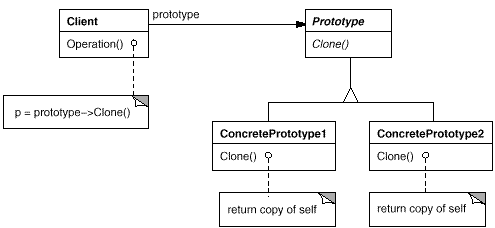

# 设计模式读书笔记：Prototype（原型）
_2015-07-03 11:36:44_

* * *

意图：

用原型实例指定创建对象的种类，并且通过拷贝这些原型创建新的对象。

结构图：来自《23种设计模式 - 郗晓勇》



实现：https://github.com/panshiqu/patterns/tree/master/Prototype

Prototype

```
namespace NS_PROTOTYPE {

class Prototype {
public:
	Prototype() {}
	virtual ~Prototype() {}
	virtual Prototype *clone(void) = 0;
	virtual void printSelf(void) = 0;
};

} /* namespace NS_PROTOTYPE */
```

ConcretePrototype1

```
#include "Prototype.h"
#include <iostream>

namespace NS_PROTOTYPE {

class ConcretePrototype1 : public Prototype
{
public:
	ConcretePrototype1() : _index(0) {}
	virtual ~ConcretePrototype1() {}
	virtual Prototype *clone(void)
	{
		ConcretePrototype1 *prototype = new ConcretePrototype1();
		prototype->setIndex(getIndex());
		return prototype;
	}
	virtual void printSelf(void)
	{
		std::cout << "index: " << _index << std::endl;
	}

	int getIndex(void)		{ return _index; }
	void setIndex(int index){ _index = index; }

private:
	int _index;
};

} /* namespace NS_PROTOTYPE */
```

ConcretePrototype2

```
#include "Prototype.h"
#include <iostream>

namespace NS_PROTOTYPE {

class ConcretePrototype2 : public Prototype
{
public:
	ConcretePrototype2() : _index("zero") {}
	virtual ~ConcretePrototype2() {}
	virtual Prototype *clone(void)
	{
		ConcretePrototype2 *prototype = new ConcretePrototype2();
		prototype->setIndex(getIndex());
		return prototype;
	}
	virtual void printSelf(void)
	{
		std::cout << "index: " << _index << std::endl;
	}

	std::string getIndex(void)			{ return _index; }
	void setIndex(std::string index)	{ _index = index; }

private:
	std::string _index;
};

} /* namespace NS_PROTOTYPE */
```

main

```
#include "Prototype/ConcretePrototype1.h"
#include "Prototype/ConcretePrototype2.h"
using namespace NS_PROTOTYPE;
int main(void)
{
	ConcretePrototype1 *p1 = new ConcretePrototype1();
	ConcretePrototype2 *p2 = new ConcretePrototype2();
	p1->setIndex(10);
	p2->setIndex("ten");

	Prototype *cp1 = p1->clone();
	Prototype *cp2 = p2->clone();

	p1->printSelf();
	p2->printSelf();
	cp1->printSelf();
	cp2->printSelf();

	delete p1;
	delete p2;
	delete cp1;
	delete cp2;
}
```

实现：
