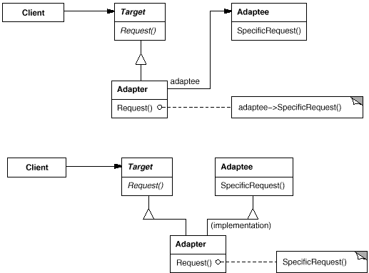

# 设计模式读书笔记：Adapter Class/Object（适配器）
_2015-07-07 17:35:32_

* * *

意图：

将一个类的接口转换成客户希望的另外一个接口。Adapter 模式使得原本由于接口不兼容而不能一起工作的那些类可以一起工作。

结构图：来自 《23种设计模式 - 郗晓勇》



实现：https://github.com/panshiqu/patterns/tree/master/Adapter

Adaptee

```
#include <iostream>

namespace NS_ADAPTER {

class Adaptee {
public:
	Adaptee() {}
	virtual ~Adaptee() {}
	void SpecificRequest(void)
	{
		std::cout << "SpecificRequest." << std::endl;
	}
};

} /* namespace NS_ADAPTER */
```

AdapterA

```
// 类适配器

#include "Target.h"
#include "Adaptee.h"

namespace NS_ADAPTER {

class AdapterA : public Target, private Adaptee
{
public:
	AdapterA() {}
	virtual ~AdapterA() {}
	virtual void Request(void)
	{
		SpecificRequest();
	}
};

} /* namespace NS_ADAPTER */
```

AdapterB

```
// 对象适配器

#include "Target.h"
#include "Adaptee.h"

namespace NS_ADAPTER {

class AdapterB : public Target
{
public:
	AdapterB(Adaptee *adaptee) : _adaptee(adaptee) {}
	virtual ~AdapterB() {}
	virtual void Request(void)
	{
		_adaptee->SpecificRequest();
	}

private:
	Adaptee *_adaptee;
};

} /* namespace NS_ADAPTER */
```

Target

```
#include <iostream>

namespace NS_ADAPTER {

class Target {
public:
	Target() {}
	virtual ~Target() {}
	virtual void Request(void)
	{
		std::cout << "Request." << std::endl;
	}
};

} /* namespace NS_ADAPTER */
```

main

```
#include "Adapter/AdapterA.h"
#include "Adapter/AdapterB.h"
using namespace NS_ADAPTER;
int main(void)
{
	// 类适配器
	AdapterA aa;
	aa.Request();

	// 对象适配器
	Adaptee ada;
	AdapterB ab(&ada);
	ab.Request();
}
```

附加：
