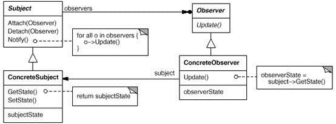

# 设计模式读书笔记：Observer（观察者）
_2015-07-10 21:18:45_

* * *

意图：

定义对象间的一种一对多的依赖关系,当一个对象的状态发生改变时, 所有依赖于它的对象都得到通知并被自动更新。

结构图：来自 《23种设计模式 - 郗晓勇》



实现：https://github.com/panshiqu/patterns/tree/master/Observer

Observer

```
namespace NS_OBSERVER {

class Observer {
public:
	Observer() {}
	virtual ~Observer() {}
	virtual void update(void) = 0;
};

} /* namespace NS_OBSERVER */
```

ConcreteObserver

```
#include <iostream>
#include "Observer.h"
#include "ConcreteSubject.h"

namespace NS_OBSERVER {

class ConcreteObserver : public Observer
{
public:
	ConcreteObserver(ConcreteSubject *subject) : _observerState(false), _subject(subject)
	{
		_subject->attach(this);
	}

	virtual ~ConcreteObserver()
	{
		_subject->detach(this);
	}

	virtual void update(void)
	{
		_observerState = _subject->getSubjectState();
		std::cout << "State: " << _observerState << std::endl;
	}

private:
	bool _observerState;
	ConcreteSubject *_subject;
};

} /* namespace NS_OBSERVER */
```

Subject

```
#include <list>
#include <iostream>
#include "Observer.h"

namespace NS_OBSERVER {

class Subject {
public:
	Subject() {}
	virtual ~Subject()
	{
		_observers.clear();
	}

	void attach(Observer *observer)
	{
		// 多线程这里的链表操作考虑加锁
		_observers.push_back(observer);
	}

	void detach(Observer *observer)
	{
		// 多线程这里的链表操作考虑加锁
		_observers.remove(observer);
	}

	void notify(void)
	{
		// 多线程这里的链表操作考虑加锁
		std::list<Observer *>::iterator itr = _observers.begin();
		for (; itr != _observers.end(); itr++)
		{
			(*itr)->update();
		}
	}

private:
	std::list<Observer *> _observers;
};

} /* namespace NS_OBSERVER */
```

ConcreteSubject

```
#include "Subject.h"

namespace NS_OBSERVER {

class ConcreteSubject : public Subject
{
public:
	ConcreteSubject() : _subjectState(true) {}
	virtual ~ConcreteSubject() {}

	bool getSubjectState(void)		{ return _subjectState; }
	void setSubjectState(bool subjectState)	{ _subjectState = subjectState; }

private:
	bool _subjectState;
};

} /* namespace NS_OBSERVER */
```

main

```
#include "Observer/ConcreteSubject.h"
#include "Observer/ConcreteObserver.h"
using namespace NS_OBSERVER;
int main(void)
{
	// 简单的拉模型：Observer仅接受通知，然后主动向Subject要状态
	// 若是推模型，则要扩展Update接口了
	ConcreteSubject cs;
	ConcreteObserver co1(&cs);
	ConcreteObserver co2(&cs);
	cs.notify();
}
```

附加：
