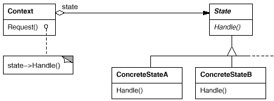

# 设计模式读书笔记：State（状态）
_2015-07-10 21:27:54_

* * *

意图：

允许一个对象在其内部状态改变时改变它的行为。对象看起来似乎修改了它的类。

结构图：来自 《23种设计模式 - 郗晓勇》



实现：https://github.com/panshiqu/patterns/tree/master/State

Context

```
namespace NS_STATE {

class State;
class Context {
public:
	Context(State *state) : _state(state) {}
	virtual ~Context() {}
	void request(void);

private:
	friend class State;
	void changeState(State *state);

private:
	State *_state;
};

} /* namespace NS_STATE */
```

```
#include "Context.h"
#include "State.h"

namespace NS_STATE {

void Context::request(void)
{
	_state->handle(this);
}

void Context::changeState(State *state)
{
	_state = state;
}

} /* namespace NS_STATE */
```

State

```
#include "Context.h"

namespace NS_STATE {

class State {
public:
	State() {}
	virtual ~State() {}
	virtual void handle(Context *context) = 0;

protected:
	void changeState(Context *context, State *state)
	{
		context->changeState(state);
	}
};

} /* namespace NS_STATE */
```

ConcreteStateA

```
#include "State.h"
#include "ConcreteStateB.h"
#include <iostream>

namespace NS_STATE {

class ConcreteStateA : public State
{
public:
	ConcreteStateA() {}
	virtual ~ConcreteStateA() {}
	virtual void handle(Context *context)
	{
		std::cout << "ConcreteStateA." << std::endl;
		changeState(context, ConcreteStateB::getInstance());
	}
};

} /* namespace NS_STATE */
```

ConcreteStateB

```
#include "State.h"
#include <iostream>

namespace NS_STATE {

class ConcreteStateB : public State
{
public:
	ConcreteStateB() {}
	virtual ~ConcreteStateB() {}
	static ConcreteStateB *getInstance(void)
	{
		static ConcreteStateB instance;
		return &instance;
	}
	virtual void handle(Context *context)
	{
		std::cout << "ConcreteStateB." << std::endl;
	}
};

} /* namespace NS_STATE */
```

main

```
#include "State/Context.h"
#include "State/ConcreteStateA.h"
#include "State/ConcreteStateB.h"
using namespace NS_STATE;
int main(void)
{
	ConcreteStateA csa;
	Context c(&csa);
	c.request();
	c.request();
}
```

附加：
