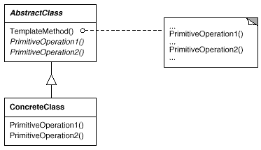

# 设计模式读书笔记：Template Method（模板方法）
_2015-07-10 21:40:31_

* * *

意图：

定义一个操作中的算法的骨架，而将一些步骤延迟到子类中。TemplateMethod 使得子类可以不改变一个算法的结构即可重定义该算法的某些特定步骤。

结构图：来自 《23种设计模式 - 郗晓勇》



实现：https://github.com/panshiqu/patterns/tree/master/TemplateMethod

AbstractClass

```
#include <iostream>

namespace NS_TEMPLATEMETHOD {

class AbstractClass {
public:
	AbstractClass() {}
	virtual ~AbstractClass() {}
	void templateMethod(void)
	{
		begin();
		primitiveOperation();
		end();
	}

	void begin(void)	{ std::cout << "This is a popular calculator." << std::endl; }
	void end(void)		{ std::cout << "Bye-bye." << std::endl; }

protected:	// 只被模板方法调用
	virtual void primitiveOperation(void) {}
};

} /* namespace NS_TEMPLATEMETHOD */
```

ConcreteClass

```
#include "AbstractClass.h"

namespace NS_TEMPLATEMETHOD {

class ConcreteClass : public AbstractClass
{
public:
	ConcreteClass() {}
	virtual ~ConcreteClass() {}

	// 若不实现将使用父类方法
	virtual void primitiveOperation(void)
	{
		int a, b;
		std::cin >> a;std::cin >> b;
		std::cout << "a+b = " << a+b << std::endl;
	}
};

} /* namespace NS_TEMPLATEMETHOD */
```

main

```
#include "TemplateMethod/ConcreteClass.h"
using namespace NS_TEMPLATEMETHOD;
int main(void)
{
	ConcreteClass cc;
	cc.templateMethod();
}
```

附加：
