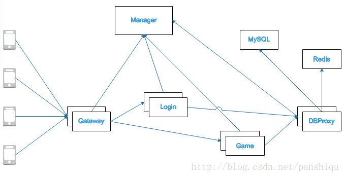

# 中小型棋牌类网络游戏服务端架构
_2017-04-14 17:24:08_

* * *

## Gateway

 1. 服务器仅暴露 Gateway 监听端口，Client 与 Server 之间通讯均通过 Gateway 转发
 2. Client 与 Gateway 仅建立一条连接，Gateway 可与多种 Server（Login、Game）建立连接，初步设想同一时间仅保留一条连接，内网连接的切换代价不高，当然同时保留多条连接也行
 3. Gateway 应具备以下功能：加密与解密、压缩与解压，我个人认为没有太大必要让除 Gateway 之外的 Server 具备压缩与解压，逻辑简单就好

## Manager

 1. 所有的 Gateway、Server、DBProxy 均来这里注册注销用于 Client、Gateway、Server 发现可用的 Gateway、Server、DBProxy，来注册的服务，应即时报告当前处理数量，实现负载均衡；应具有状态（开放、关闭），实现伪热切换
 2. 提供管理接口：开关指定服务，消息广播（系统消息，全局消息），查找和通知玩家所在 GameServer 玩家充值事件等等

## Login

 1. 玩家注册，玩家鉴权登陆，和不需要缓存玩家信息的所有逻辑（玩家在大厅里的操作）

## Game

 1. 缓存玩家信息实现游戏相关逻辑

## DBProxy

 1. 数据缓存与持久化，监听并与 Login、Game 进行交互

## Message

 1. 消息头（长度32bit + 标识8bit + 主命令16bit + 子命令16bit） + 消息体
 2. 标识用来按位指定是否加密是否压缩
 3. 使用网络字节序即大端字节序
 4. 从主命令开始加密压缩

## 注：

 1. Manager 只会启动一个，剩余所有服务均可多开进而负载均衡
 2. 客户端发送心跳包，服务端接收心跳包，实现客户端保活
 3. 应该会为每个服务启用守护进程（supervisor）
 4. 这里并未独立出来日志服务器，先这样吧
 5. 有些架构中把登陆服务器放在第一位，它的登陆和我的登陆意义不同，它的登陆像是一个用户中心
 6. 客户端获取 Gateway 地址列表，要么自己实现 Http 服务，要么购买相关云服务，相较于 DNS 指向这些地址更加灵活
 7. 没有最好的架构，只有最适合的架构，随着架构承载不起当前人数，我认为我会高兴的加班调整已不那么适合的架构，其实本架构我设想的是应对中小型棋牌游戏项目

思考的时候有很多想要额外说明的，成文时却东忘西忘，想到时再来补充吧

2017.4.15
关于 Login 想再多说些，它所实现的功能不能仅通过它的名称来感觉，若把 Login 再拆成 Login、Lobby 也不为过，但是会让架构稍微复杂些，若非要去掉 Login 把所有逻辑揉进 Game 也并非不可实现，我这里所想的也只是满足中小型这个期望作折衷而已，如何来判定指定逻辑是否应该写入 Login 服务器，我举例来说明我的想法，譬如注册、登陆、签到、排行榜等等，这些逻辑可以通过 Login 与 DBProxy 直接交互返回结果，它们就应该写入 Login 服务器
